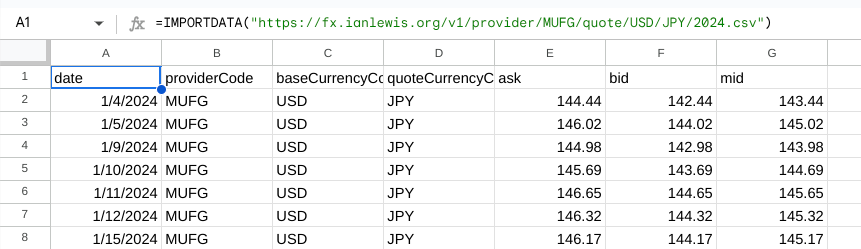

# `fx.ianlewis.org`

`fx.ianlewis.org` is a currency conversion API. It currently supports
[MUFG](https://www.bk.mufg.jp/ippan/gaitame/index.html)
published rates between 31 currencies and JPY.

## Data Types & Endpoints

The following sections outline the various data types available in the API.

- [Swagger UI](https://petstore.swagger.io/?url=https://fx.ianlewis.org/v1/openapi.yaml)
- [Redoc](https://redocly.github.io/redoc/?url=https://fx.ianlewis.org/v1/openapi.yaml)

The full OpenAPI definition can be viewed at [`/v1/openapi.yaml`](/v1/openapi.yaml).

### Provider

Currency exchange provider information can be retrieved via the provider
endpoint. The `Provider` object's format is defined in
[`provider.proto`](https://github.com/ianlewis/fx/blob/main/fx/provider.proto).

#### [`/v1/provider.json`](/v1/provider.json)

```json
{
    "providers": [
        {
            "code": "MUFG",
            "name": "MUFG Bank, Ltd."
            // ...
        }
        // ...
    ]
}
```

Individual providers can be accessed via their [ISO
4217](https://en.wikipedia.org/wiki/ISO_4217) currency code.

#### [`/v1/provider/MUFG.json`](/v1/provider/MUFG.json)

```json
{
    "code": "MUFG",
    "name": "MUFG Bank, Ltd.",
    "supportedBaseCurrencies": [
        "USD",
        "EUR",
        "CAD",
        "GBP",
        "CHF",
        "DKK",
        "NOK",
        "SEK",
        "AUD",
        "NZD",
        "HKD",
        "MYR",
        "SGD",
        "SAR",
        "AED",
        "CNY",
        "THB",
        "INR",
        "PKR",
        "KWD",
        "QAR",
        "IDR",
        "MXN",
        "KRW",
        "PHP",
        "ZAR",
        "CZK",
        "RUB",
        "HUF",
        "PLN",
        "TRY"
    ],
    "supportedQuoteCurrencies": ["JPY"]
}
```

### Quotes

Currency exchange rate quotes can be retrieved via a provider's quote endpoint. The
`Quote` object's format is defined in
[`quote.proto`](https://github.com/ianlewis/fx/blob/main/fx/quote.proto).

Quotes for a single day can be accessed by date.

#### [`/v1/provider/MUFG/quote/USD/JPY/2025/03/11.json`](/v1/provider/MUFG/quote/USD/JPY/2025/03/11.json)

```json
{
    "providerCode": "MUFG",
    "date": {
        "year": 2025,
        "month": 3,
        "day": 11
    },
    "baseCurrencyCode": "USD",
    "quoteCurrencyCode": "JPY",
    "ask": {
        "currencyCode": "JPY",
        "units": "147",
        "nanos": 680000000
    },
    "bid": {
        "currencyCode": "JPY",
        "units": "145",
        "nanos": 680000000
    },
    "mid": {
        "currencyCode": "JPY",
        "units": "146",
        "nanos": 680000000
    }
}
```

#### [`/v1/provider/MUFG/quote/USD/JPY/latest.json`](/v1/provider/MUFG/quote/USD/JPY/latest.json)

The most recent quote for a currency pair can be accessed via the `latest` endpoint.

```json
{
    "providerCode": "MUFG",
    "date": {
        "year": 2025,
        "month": 9,
        "day": 22
    },
    "baseCurrencyCode": "USD",
    "quoteCurrencyCode": "JPY",
    "ask": {
        "currencyCode": "JPY",
        "units": "149",
        "nanos": 290000000
    },
    "bid": {
        "currencyCode": "JPY",
        "units": "147",
        "nanos": 290000000
    },
    "mid": {
        "currencyCode": "JPY",
        "units": "148",
        "nanos": 290000000
    }
}
```

## Formats

Each endpoint can be accessed in JSON (`.json`), CSV (`.csv`), and Protocol
Buffers Wire format (`.binpb`) via their associated file extension.

For example, the endpoint
[`/v1/provider/MUFG/quote/USD/JPY/2025/03.csv`](/v1/provider/MUFG/quote/USD/JPY/2025/03.csv)
returns the following CSV data.

```csv
date,providerCode,baseCurrencyCode,quoteCurrencyCode,ask,bid,mid
2025/03/03,MUFG,USD,JPY,151.56,149.56,150.56
2025/03/04,MUFG,USD,JPY,150.26,148.26,149.26
2025/03/05,MUFG,USD,JPY,150.87,148.87,149.87
2025/03/06,MUFG,USD,JPY,150.25,148.25,149.25
2025/03/07,MUFG,USD,JPY,149.07,147.07,148.07
2025/03/10,MUFG,USD,JPY,148.38,146.38,147.38
2025/03/11,MUFG,USD,JPY,147.68,145.68,146.68
2025/03/12,MUFG,USD,JPY,149.08,147.08,148.08
...
```

## Importing Data

You can import CSV data into spreadsheets.

### Google Sheets

Use the `IMPORTDATA` function to import data into the sheet. In the top-left
cell where you would like to import the data add the following formula with the
URL to the desired data.

```text
=IMPORTDATA("https://fx.ianlewis.org/v1/provider/MUFG/quote/USD/JPY/2024.csv")
```


